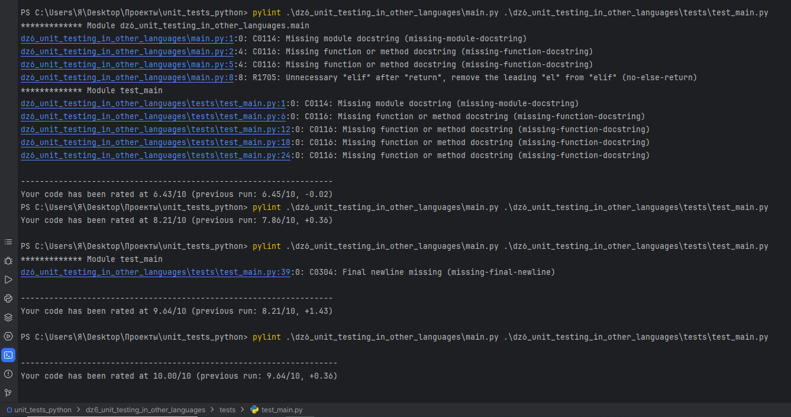
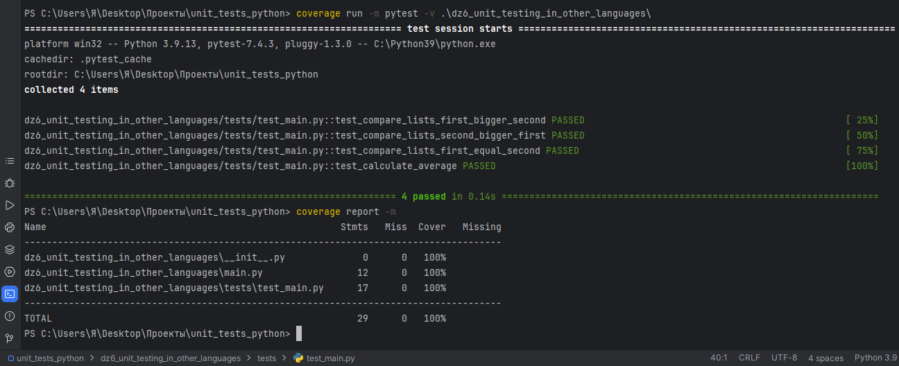

Динамика приведения кода к максимальному качеству по версии pylint  

Отчет покрытия тестов 

В данном примере тестирования покрыты следующие сценарии:

1. Сравнение случая, когда среднее значение первого списка больше среднего значения второго списка.
2. Сравнение случая, когда среднее значение второго списка больше среднего значения первого списка.
3. Сравнение случая, когда средние значения обоих списков равны.
4. Проверка правильности расчета среднего значения.

Выбор данных сценариев обусловлен желанием охватить все возможные результаты функции сравнения списков и расчета среднего значения.
Это позволяет удостовериться, что программа работает правильно в различных ситуациях, что важно для обеспечения корректной работы самой программы.